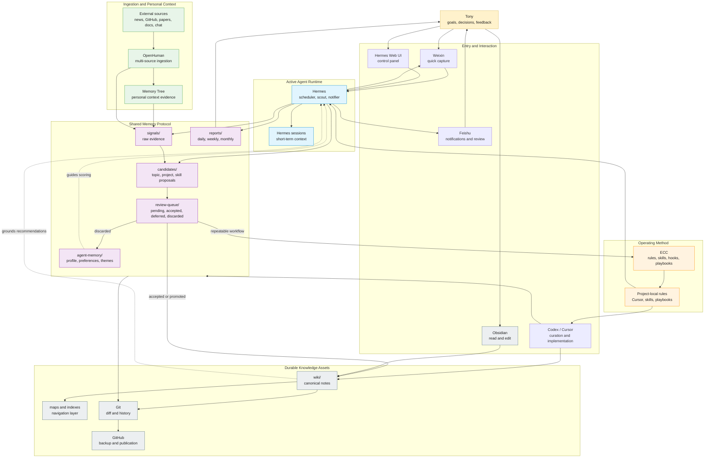
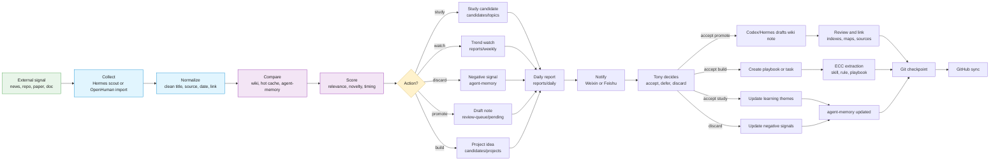
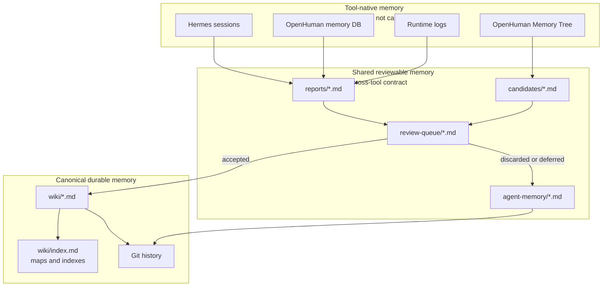

# AI First Work Center Collaboration Map

Navigation: [[_index]] | [[Autonomous AI First Learning Engine]] | [[Personal AI Work Center Architecture]]

## Diagram 1: Collaboration Architecture

This diagram answers: who does what, where memory lives, and what is allowed to write durable knowledge.



## Diagram 2: Daily Autonomous Learning Flow

This diagram answers: how a real external signal becomes a learning recommendation or durable note.



## Diagram 3: Memory Ownership

This diagram answers: which memory is allowed to be trusted.



## Collaboration Rules

- Hermes can proactively collect, score, recommend, and notify.
- OpenHuman can ingest broad sources and produce personal-context evidence.
- ECC can capture repeatable workflows as skills, rules, hooks, and playbooks.
- Obsidian is where durable knowledge is read and shaped.
- GitHub is where reviewed knowledge becomes portable and recoverable.
- Hidden tool memory is useful, but Markdown plus Git is the shared truth.

## First Implementation Slice

Build `Daily AI Learning Scout`:

```text
Hermes scheduled job
-> collect sources
-> compare with wiki/hot.md and agent-memory
-> write candidates and daily report
-> notify Weixin or Feishu
-> Tony decides
-> accepted items become wiki notes or ECC playbooks
```
