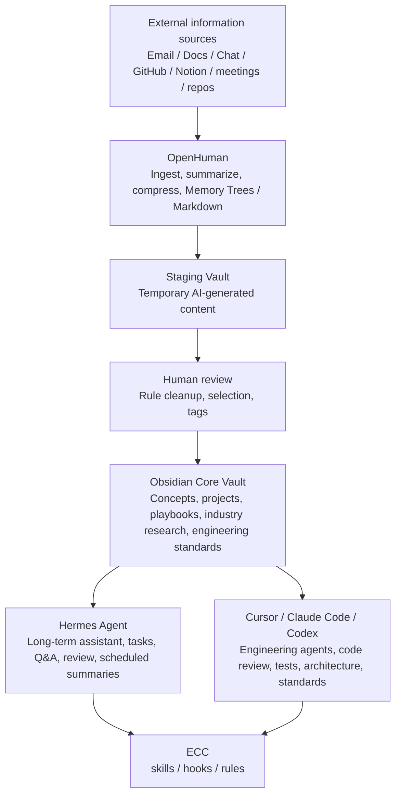

# AI First Layered Knowledge Architecture

## Core Decision

Do not build `OpenHuman + Hermes + ECC` as one giant knowledge system. Build a layered system:

- Obsidian is the knowledge asset center.
- OpenHuman is the information ingestion layer.
- Hermes is the long-running personal agent.
- ECC is the engineering agent capability layer.
- Cursor, Claude Code, and Codex are daily engineering entry points.

The core risk is not installation conflict. The core risk is ownership conflict: who can write memory, who can modify the vault, who controls agent rules, and who registers tools.

The preferred integration pattern is not shared internal memory. The preferred pattern is a shared external memory protocol: Markdown, YAML, JSON, review states, and Git history that all tools can read or write within scoped boundaries.

## Flow



## Directory Boundary

OpenHuman should only write to a staging area, never directly into the core knowledge structure.

```text
00-Inbox-AI/
  openhuman/
    gmail/
    docs/
    chats/
    repos/
    summaries/
```

Valuable material is then promoted into formal areas such as:

```text
02-Concepts/
03-Projects/
04-Playbooks/
06-Work/
08-MOCs/
10-Industries/
11-English/
```

In this vault's current structure, the equivalent formal targets are mostly `wiki/concepts/`, `wiki/practice/`, `wiki/tools/`, `wiki/open-source/`, `wiki/entities/`, `wiki/comparisons/`, and `wiki/questions/`.

## OpenHuman Role

OpenHuman is an ingestion tool, not a source of truth.

Use it for:

- Pulling external sources into a staging area.
- Generating first-pass summaries.
- Compressing noisy source material.
- Creating preliminary Memory Trees or Markdown drafts.

Do not let it:

- Write directly into formal wiki directories.
- Rewrite canonical notes.
- Become the main long-term memory.
- Connect high-risk integrations before the staging and review workflow is tested.

## Hermes Role

Hermes is the long-running context assistant.

Use it for:

- Daily review of newly added notes.
- Weekly project progress summaries.
- Extracting decisions from conversations.
- Turning incidents into playbooks.
- Answering questions from the Obsidian vault.
- Generating context summaries for Cursor or Codex.
- Reminding which knowledge should be archived or promoted.

Hermes should operate on the vault, but durable knowledge still lands in Markdown.

## ECC Role

ECC belongs mainly in engineering workflows.

Use it for:

- Cursor rules.
- Claude Code skills.
- Code review norms.
- Test-case generation workflows.
- AI-first engineering delivery workflows.
- Security scanning.
- Context loading rules.
- Development task decomposition templates.
- Incident-review extraction templates.

ECC should be promoted into playbooks and agent rules selectively. It should not take over all global Codex, Claude, MCP, hooks, or memory configuration without a reviewed install plan.

## Operating Rule

Only reviewed, promoted content enters the core vault. AI-generated or integration-generated material starts in staging. Agent memories are caches and context aids, not canonical knowledge.

See [[Autonomous AI First Learning Engine]] for the proactive loop where Hermes, OpenHuman, and ECC collaborate through staged signals, candidate topics, review decisions, and promoted knowledge.
