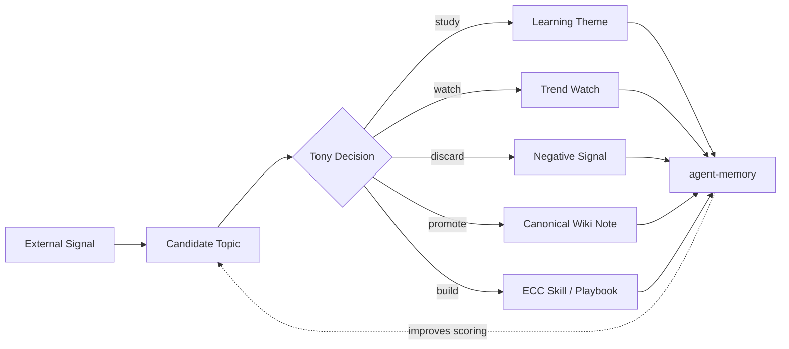

# Agentic Data Engineering for Model Specialization

Navigation: [[_index]] | [[Exploring Autonomous Agentic Data Engineering for Model Specialization]] | [[Daily AI Learning Scout Demo]]

## Pattern

Agentic Data Engineering is a loop where an agent treats data as an object to improve, not as a static input.

For this vault:

```text
External signals
-> candidate learning data
-> review decisions
-> improved agent memory
-> better future candidate selection
```

## Why This Is Useful

The current AI First work center should not only collect information. It should improve its own selection quality over time.

The key move is to use Tony's decisions as feedback:

- `study` raises priority for similar future signals.
- `watch` keeps a topic in trend tracking.
- `discard` becomes negative training data.
- `promote` proves a signal was durable enough for `wiki/`.
- `build` proves the signal should become a workflow or tool.

## Operating Loop



## Apply To Daily AI Learning Scout

The next version of `scripts/daily_ai_learning_scout.py` should:

- Read accepted, deferred, and discarded review decisions.
- Increase score for repeated accepted themes.
- Lower score for repeated discarded noise.
- Separate `paper`, `tool`, `security`, `open-source`, and `architecture` candidates.
- Generate one "why this matters to Tony" line using agent memory.
- Keep raw signals separate from recommendations.

## Minimal Feedback Schema

Each reviewed candidate should eventually have:

```yaml
candidate_id: "2026-06-01-002"
decision: "promote"
topic: "Autonomous Agentic Data Engineering"
source: "arXiv:2605.30407"
reason: "Directly supports AI First autonomous learning-loop design."
next_action: "Create paper note and practice playbook."
```

## Guardrails

- Do not let automatic scoring promote notes directly into `wiki/`.
- Do not treat LLM-generated summaries as source truth.
- Keep source links and review decisions together.
- Use discarded items as valuable negative preferences.
- Prefer one good promoted note over many shallow captured summaries.

## Follow-up

- Add `accepted` and `discarded` decision readers to the scout.
- Add a weekly "quality trend" report.
- Test whether accepted decisions improve candidate ranking after 7 days.
