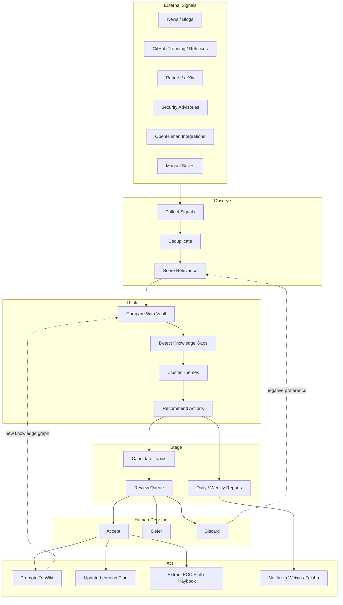

# Autonomous AI First Learning Engine

Navigation: [[_index]] | [[Personal AI Work Center Architecture]] | [[AI First Layered Knowledge Architecture]]

## Intent

The goal is not a command-driven note bot.

The goal is an autonomous AI-first learning engine:

```text
External world changes
-> Agent notices signals
-> Agent compares with my existing knowledge graph
-> Agent proposes what I should learn, build, or ignore
-> Agent writes candidates into staging
-> I approve the direction
-> Codex/Hermes promotes durable knowledge into the vault
-> The system remembers the preference and improves the next cycle
```

The important shift is from `I choose a topic` to `the system proposes topics based on evidence`.

## Short Answer

Hermes, OpenHuman, and ECC can work together, but they should not directly share one internal memory store.

They should share one external memory protocol built on Markdown, Git, and explicit review states.

| System | Best role | Memory risk | Integration rule |
|---|---|---|---|
| Hermes | Autonomous runner, scheduler, notification, long-running assistant | May mix sessions, skills, shell, channel messages, and self-authored memory | Let it write reports and candidates, not final truth |
| OpenHuman | Multi-source ingestion, Memory Tree, semantic recall, personal context | May over-compress or over-trust noisy integrations | Export to staging; treat Memory Tree as evidence, not verdict |
| ECC | Engineering method, rules, hooks, skills, MCP hygiene | May over-install hooks/rules/MCP and change agent behavior globally | Promote selectively into project-level rules/playbooks first |

## Shared Memory Protocol

Use directories as the contract between systems:

```text
00-Inbox-AI/
  signals/
    news/
    github/
    papers/
    industry/
    openhuman/
  candidates/
    topics/
    projects/
    skills/
    sources/
  review-queue/
    pending/
    accepted/
    deferred/
    discarded/
  agent-memory/
    profile.md
    preferences.md
    learning-themes.md
    negative-signals.md
  reports/
    daily/
    weekly/
    monthly/

wiki/
  concepts/
  tools/
  open-source/
  practice/
  questions/
  maps/
```

The protocol rule:

```text
Signals and candidates can be produced automatically.
Promoted wiki notes require review or an explicit high-confidence rule.
Agent memory summaries are visible Markdown, not hidden-only database state.
```

## Autonomous Loop



## What Hermes Should Do

Hermes is the active operator.

Use Hermes for:

- Scheduled news and source checks.
- Fresh-session daily or weekly analysis.
- Weixin or Feishu notifications.
- Candidate topic generation.
- Lightweight memory updates.
- Running scripts that collect external signals.
- Asking for confirmation before promotion.

Important constraint: Hermes cron jobs run fresh sessions. A job prompt must be self-contained and must persist state to files if it needs memory across runs.

Therefore Hermes should write each run's evidence and decision state to Markdown or JSON in `00-Inbox-AI/`.

## What OpenHuman Should Do

OpenHuman is the broad ingestion and semantic memory layer.

Use OpenHuman for:

- Gmail, docs, Notion, chat, GitHub, browser-like personal context after risk review.
- Memory Tree summaries.
- Obsidian-compatible Markdown exports.
- Finding personal-context relevance that normal RSS/news collection cannot see.

Do not let OpenHuman directly rewrite `wiki/`.

OpenHuman's job is to answer:

```text
Given what I do and read, why does this new signal matter to me?
```

## What ECC Should Do

ECC is not a memory database. ECC is the operating method.

Use ECC for:

- Turning repeated workflows into skills.
- Defining review gates.
- Installing only project-level rules first.
- Keeping MCP/tool sprawl under control.
- Creating engineering playbooks from successful agent runs.

ECC's job is to answer:

```text
When this workflow repeats, how should agents execute it reliably next time?
```

## Proposed Memory Layers

| Layer | Owner | Format | Purpose |
|---|---|---|---|
| Raw memory | OpenHuman, Hermes, scripts | SQLite, session DB, logs | Tool-native recall and debugging |
| Shared memory | This vault | Markdown / YAML / JSON | Cross-tool truth and state |
| Preference memory | This vault | `agent-memory/*.md` | What the system believes about my goals |
| Procedural memory | ECC / Hermes skills | `SKILL.md`, rules, playbooks | How to repeat useful workflows |
| Canonical knowledge | Obsidian wiki | Markdown notes, maps, indexes | Durable knowledge asset |
| Publication memory | GitHub | Git history, releases, issues | Audit, backup, external review |

## First Autonomous Product

Build one narrow autonomous workflow first:

```text
Daily AI Learning Scout
```

It should:

1. Collect 20-50 signals from AI engineering, open-source AI, agent tooling, and security.
2. Compare them against current wiki themes and legacy vault inventory.
3. Produce 5 candidate topics.
4. Explain why each candidate matters to me.
5. Mark each candidate as `study`, `watch`, `discard`, or `promote`.
6. Notify me on Weixin or Feishu.
7. Persist everything under `00-Inbox-AI/reports/daily/` and `00-Inbox-AI/candidates/topics/`.

Success is not "many articles collected". Success is "the system proposes better learning directions than I would have remembered to ask for".

## Review Strategy

The review queue should capture decisions:

| Decision | Meaning | Memory impact |
|---|---|---|
| `study` | I want to learn this soon | Raise priority for related signals |
| `watch` | Interesting but not urgent | Keep in weekly trend report |
| `discard` | Not relevant or too noisy | Add to negative signals |
| `promote` | Worth formal knowledge note | Create or update wiki note |
| `build` | Worth implementing as workflow/tool | Create task or playbook |

The discarded items are important. They teach the system what not to bother me with.

## Trust Model

Autonomy should increase in stages:

| Stage | Agent can do | Agent cannot do |
|---|---|---|
| 1 | Collect, summarize, recommend | Modify core wiki |
| 2 | Write candidates and review queue | Commit to GitHub automatically |
| 3 | Draft wiki notes for accepted topics | Publish without scan |
| 4 | Update indexes and maps after promotion | Touch secrets or global configs |
| 5 | Commit reviewed batches | Force-push or bypass review |

## Next Build Steps

1. Create the shared memory directories under `00-Inbox-AI/`.
2. Implement `Daily AI Learning Scout` as a script-backed Hermes cron or local script.
3. Add source lists for AI engineering, open-source AI, security, and industry signals.
4. Add candidate scoring based on current `wiki/hot.md`, legacy inventory, and accepted/discarded history.
5. Send the daily report to Weixin first; add Feishu card messages later if useful.
6. Add OpenHuman only after this loop works with transparent files.
7. Promote stable workflows into ECC-style skills and playbooks.

## Sources

- [Hermes Agent Documentation](https://hermes-agent.nousresearch.com/docs/)
- [Hermes Cron Internals](https://hermes-agent.nousresearch.com/docs/developer-guide/cron-internals)
- [OpenHuman Wiki](https://openhumanwiki.com/)
- [ECC README](https://github.com/affaan-m/ECC/blob/main/README.md)
