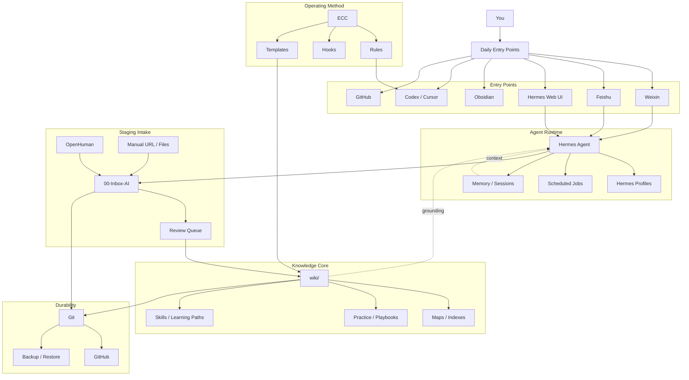

# Personal AI Work Center Architecture

Navigation: [[_index]] | [[AI First Layered Knowledge Architecture]] | [[Hermes Web UI Control Center]] | [[Autonomous AI First Learning Engine]]

## Goal

Build a personal AI work center where the computer gradually understands:

- What I am learning.
- What I care about.
- What I am likely to ask next.
- What output formats I prefer.
- Which topics are worth continuing.
- Which notes, projects, and skills should be promoted into long-term knowledge.

The system should make daily learning easier without hiding knowledge inside an opaque app.

See [[Autonomous AI First Learning Engine]] for the more proactive operating loop where agents monitor external signals and recommend learning or building actions.

## Core Principle

Obsidian Markdown is the durable brain. Everything else is an assistant, ingestion layer, execution layer, or operating method.

If something matters, it must eventually become a readable Markdown note that can be searched, reviewed, diffed, backed up, and pushed to GitHub.

## Layered Architecture



## Tool Responsibilities

| Tool | Role | Writes to | Trust level |
|---|---|---|---|
| Obsidian | Reading, thinking, manual editing, graph navigation | `wiki/`, reviewed notes | Highest |
| GitHub | Backup, history, portability, public/private publication | Git remote | High |
| Hermes | Long-running assistant, chat, channels, scheduled jobs | Staging first | Medium |
| Hermes Web UI | Control center for Hermes | `~/.hermes`, `~/.hermes-web-ui` | Medium |
| OpenHuman | Ingestion and personal memory experiment | `00-Inbox-AI/openhuman/` | Low at first |
| ECC | Operating method, engineering rules, repeatable skills | `wiki/practice/`, `skills/`, rules after review | Medium |
| Codex | Careful implementation, migration, validation, commits | Repo files after review | High when scoped |

## Work Center Home Screen

The practical home screen should be a small set of places:

| Need | Go to |
|---|---|
| Quick capture from phone | Weixin to Hermes |
| Control Hermes | `http://127.0.0.1:8648` |
| Read and edit knowledge | Obsidian open at `/Users/tony/Vault/tony-wiki-2026` |
| Review staged AI content | `00-Inbox-AI/` |
| Study current direction | [[hot]] and [[index]] |
| Implement structure and automation | Codex in this repo |
| Preserve and share | GitHub |

## Daily Operating Loop

1. Capture rough thoughts through Weixin or Obsidian.
2. Let Hermes answer, clarify, or summarize, but write only to staging.
3. Review `00-Inbox-AI/` once per day or every few days.
4. Promote useful items into `wiki/` as durable notes.
5. Use Obsidian to read and connect notes.
6. Use GitHub commits as checkpoints.
7. Use `wiki/hot.md` as the current working memory for the system.

## Autonomous Operating Loop

The desired end state is not only daily capture. The desired end state is proactive scouting:

1. Hermes or a script collects external signals.
2. OpenHuman adds personal-context signals after risk review.
3. The system compares signals with current wiki themes, legacy knowledge, and preference memory.
4. The system writes candidate topics and recommended actions into `00-Inbox-AI/`.
5. You decide what to study, watch, discard, promote, or build.
6. Codex/Hermes promotes approved knowledge and updates maps, indexes, and playbooks.
7. ECC captures repeatable workflows as skills, rules, or engineering playbooks.

## Weekly Operating Loop

1. Hermes summarizes what was captured this week.
2. Codex or Hermes proposes learning themes and stale questions.
3. You choose 1-3 study themes.
4. The chosen themes become notes, maps, or playbooks.
5. ECC patterns are extracted only when a workflow repeats.
6. GitHub receives a clean checkpoint after privacy review.

## How The Computer Learns You

The system should learn through visible artifacts:

| Signal | Stored as | Used for |
|---|---|---|
| Repeated questions | `wiki/questions/` or inbox review notes | Interest modeling |
| Chosen study themes | `wiki/hot.md`, maps, study notes | Learning direction |
| Promoted notes | `wiki/` | Durable knowledge graph |
| Discarded items | review queue metadata | Negative preferences |
| Weekly summaries | `00-Inbox-AI/hermes/weekly/` then promoted selectively | Long-term trend |
| Engineering fixes | `wiki/practice/` and ECC rules | Skill compounding |
| Git history | commits and diffs | Audit and rollback |

This is the safe version of personalization: the system becomes more helpful because its memory is reflected in files you can inspect.

## Implementation Phases

### Phase 1: Stabilize The Control Center

- Keep Hermes Web UI running locally.
- Change the default Web UI password.
- Keep DeepSeek as the default model.
- Keep Weixin as the first phone entry point.
- Add Feishu later only if it serves notification or team-style review better than Weixin.

### Phase 2: Build The Capture Spine

- Create `00-Inbox-AI/weixin/`.
- Support `/note`, `/save`, `/todo`, and `/query`.
- Append captures to dated Markdown files.
- Never write directly into `wiki/` from phone commands.

### Phase 2.5: Build The Autonomous Scout

- Create `00-Inbox-AI/signals/`, `00-Inbox-AI/candidates/`, `00-Inbox-AI/review-queue/`, and `00-Inbox-AI/agent-memory/`.
- Collect daily AI engineering, open-source AI, security, and industry signals.
- Compare new signals with `wiki/hot.md`, `wiki/index.md`, and legacy inventory.
- Produce candidate topics with recommended actions: `study`, `watch`, `discard`, `promote`, or `build`.
- Notify through Weixin first, Feishu later if card-style review is useful.

### Phase 3: Add Review And Promotion

- Create a Review Queue.
- Let Hermes summarize inbox candidates.
- Let Codex promote selected notes into `wiki/`.
- Track discarded, deferred, and promoted decisions.

### Phase 4: Add OpenHuman As Intake

- Install OpenHuman in an isolated mode.
- Connect only low-risk sources first.
- Export to `00-Inbox-AI/openhuman/`.
- Compare OpenHuman summaries with your own promoted notes before trusting it.

### Phase 5: Add ECC As Operating System

- Keep ECC as rules and playbooks first.
- Promote repeated engineering workflows into `wiki/practice/`.
- Only then decide whether to install ECC hooks or rules into global agent configs.

### Phase 6: Add GitHub Publication

- Run privacy and secret scans.
- Decide whether legacy import is committed whole or by domain.
- Push clean Markdown and reviewed assets.
- Keep secrets in `~/.hermes`, never in the repository.

## Recommended First Commands

Start Hermes Web UI:

```bash
cd /Users/tony/Vault/tony-wiki-2026
scripts/start-hermes-web-ui.sh
```

Check Hermes:

```bash
hermes status
hermes gateway status
hermes doctor
```

In Weixin, start with:

```text
/note 我最近想系统学习 ...
/todo 本周整理 ...
/query 我现在关于 AI Agent 的主线是什么？
```

In Obsidian, start from:

```text
wiki/hot.md
wiki/index.md
wiki/tools/Hermes Web UI Control Center.md
wiki/practice/Personal AI Work Center Architecture.md
```

## Open Questions

- Feishu should be used for notifications, review cards, or both?
- OpenHuman should ingest which low-risk source first?
- Should GitHub repository be public, private, or split into public core plus private inbox?
- Which learning areas should become first-class weekly study tracks?

## Sources

- [EKKOLearnAI Hermes Web UI](https://ekkolearnai.com/)
- [EKKOLearnAI/hermes-web-ui README](https://github.com/EKKOLearnAI/hermes-web-ui/blob/main/README.md)
